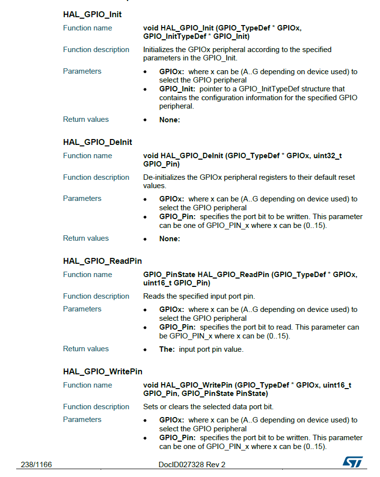
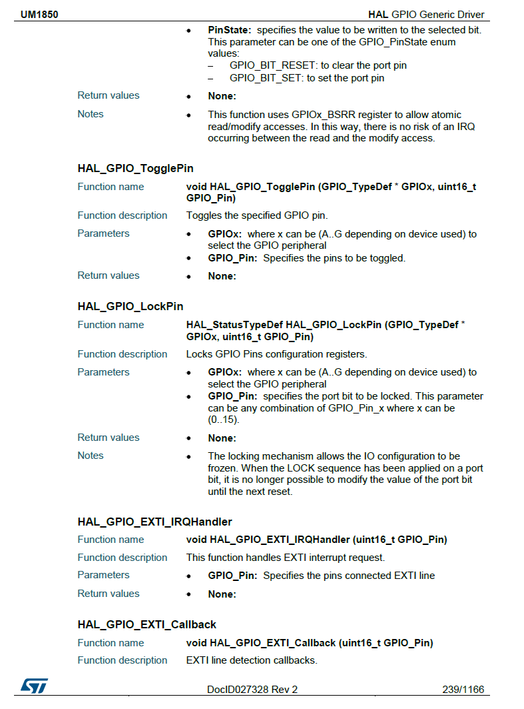
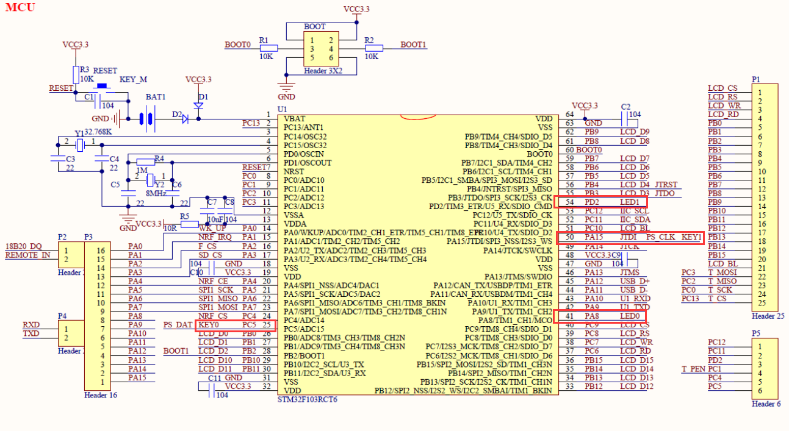
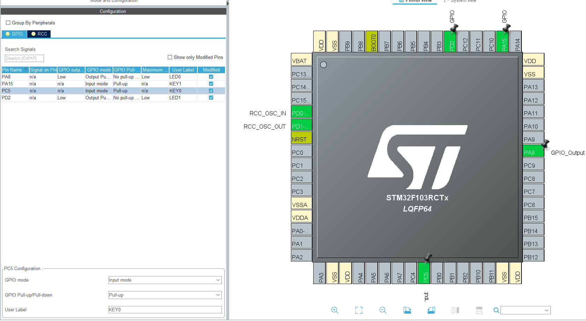

# General-purpose Input/Output

General-purpose input/output(GPIO) is the simplest I/O. Each GPIO port has four 32-bit configuration registers (GPIOx_MODER, GPIOx_OTYPER, GPIOx_OSPEEDR and GPIOx_PUPDR), two 32-bit data registers
(GPIOx_IDR and GPIOx_ODR), a 32-bit set/reset register (GPIOx_BSRR), a 32-bit locking register (GPIOx_LCKR) and two 32-bit alternate function selection register (GPIOx_AFRH and GPIOx_AFRL). Directly modify the value of register is complicated, so HAL library has define micro and function for us. More over, STM32CubeIDE provide us a more intuitive way to configure each GPIO port. Usage of register in GPIO is not introduced here, check the reference manual of STM32 F1 series for detail.

## GPIO Function Description

Each GPIO port in STM32 has 8 modes:

- Input floating
- Input pull-up
- Input pull-down
- Analog
- Output open-drain with pull-up or pull-down capability
- Output push-pull with pull-up or pull-down capability
- Alternate function push-pull with pull-up or pull-down capability
- Alternate function open-drain with pull-up or pull-down capability

Detail of each mode are not introduce here. This [blog](https://blog.stratifylabs.co/device/2013-10-21-Understanding-Microcontroller-Pin-Input-Output-Modes/) simply introduce the mode in GPIO and the corresponding feature.

## Usage

### Enable GPIO Port Clock

Before using any peripheral, the corresponding peripheral clock need to be enabled first.

```c
void __HAL_RCC_GPIOx_CLK_ENABLE(); // Enable GPIOx ports clock (x can be A, B, C, D...)
```

### Config and Initialize GPIO

Initialize the GPIOx peripheral according to the specified parameters in the ``GPIO_Init``,

```c
void HAL_GPIO_Init(GPIO_TypeDef  *GPIOx, GPIO_InitTypeDef *GPIO_Init)
```

where ``GPIO_Init`` is a struct defined as:

```c
/**
  * @brief GPIO Init structure definition
  */
typedef struct
{
  uint32_t Pin;       /*!< Specifies the GPIO pins to be configured.
                           This parameter can be any value of @ref GPIO_pins_define */

  uint32_t Mode;      /*!< Specifies the operating mode for the selected pins.
                           This parameter can be a value of @ref GPIO_mode_define */

  uint32_t Pull;      /*!< Specifies the Pull-up or Pull-Down activation for the selected pins.
                           This parameter can be a value of @ref GPIO_pull_define */

  uint32_t Speed;     /*!< Specifies the speed for the selected pins.
                           This parameter can be a value of @ref GPIO_speed_define */
} GPIO_InitTypeDef;
```

Set the fields of ``GPIO_InitTypeDef`` and pass it into ``HAL_GPIO_Init`` to initialize the corresponding GPIO port.

### Generate Code by STM32CubeIDE

We also can use graphical way provided by STM32CubeIDE to initialize GPIO. Open the **Pinout & Configuration** in **Pinout view**, click a pin and we get a list of peripherals that pin supports. If we want to use the pin to control the LED, we should choose **GPIO_Output**. If we want to read the key input, we should choose **GPIO_Input**.

Following is part of the code generated by STM32CubeIDE related to GPIO:

```c
void MX_GPIO_Init(void)
{

  GPIO_InitTypeDef GPIO_InitStruct = {0};

  /* GPIO Ports Clock Enable */
  __HAL_RCC_GPIOD_CLK_ENABLE();
  __HAL_RCC_GPIOA_CLK_ENABLE();

  /*Configure GPIO pin Output Level */
  HAL_GPIO_WritePin(GPIOA, GPIO_PIN_8, GPIO_PIN_RESET);

  /*Configure GPIO pin Output Level */
  HAL_GPIO_WritePin(GPIOD, GPIO_PIN_2, GPIO_PIN_RESET);

  /*Configure GPIO pin : PA8 */
  GPIO_InitStruct.Pin = GPIO_PIN_8;
  GPIO_InitStruct.Mode = GPIO_MODE_OUTPUT_PP;
  GPIO_InitStruct.Pull = GPIO_NOPULL;
  GPIO_InitStruct.Speed = GPIO_SPEED_FREQ_LOW;
  HAL_GPIO_Init(GPIOA, &GPIO_InitStruct);

  /*Configure GPIO pin : PD2 */
  GPIO_InitStruct.Pin = GPIO_PIN_2;
  GPIO_InitStruct.Mode = GPIO_MODE_OUTPUT_PP;
  GPIO_InitStruct.Pull = GPIO_NOPULL;
  GPIO_InitStruct.Speed = GPIO_SPEED_FREQ_LOW;
  HAL_GPIO_Init(GPIOD, &GPIO_InitStruct);

}
```

It is clear that STM32CubeIDE firstly enable the corresponding GPIO port clock, then configure the GPIO pin and initialize it.

## API

Some functions used frequently:





### Example

#### Goal

On the ALIENTEK MiniSTM32 board, use **KEY0** and **KEY1** to control two LED **DS0** and **DS1** individually.

#### Graphical Configuration in STM32CubeIDE



- Find the pins connected to **KEY0**, **KEY1**, **DS0** and **DS1**, which is **PC5**, **PA15**, **PA8** and **PD2**



- Config the corresponding pin

Following is part of the code generated by STM32CubeIDE related to GPIO:

```c
void MX_GPIO_Init(void)
{

  GPIO_InitTypeDef GPIO_InitStruct = {0};

  /* GPIO Ports Clock Enable */
  __HAL_RCC_GPIOD_CLK_ENABLE();
  __HAL_RCC_GPIOC_CLK_ENABLE();
  __HAL_RCC_GPIOA_CLK_ENABLE();

  /*Configure GPIO pin Output Level */
  HAL_GPIO_WritePin(LED0_GPIO_Port, LED0_Pin, GPIO_PIN_RESET);

  /*Configure GPIO pin Output Level */
  HAL_GPIO_WritePin(LED1_GPIO_Port, LED1_Pin, GPIO_PIN_RESET);

  /*Configure GPIO pin : PtPin */
  GPIO_InitStruct.Pin = KEY0_Pin;
  GPIO_InitStruct.Mode = GPIO_MODE_INPUT;
  GPIO_InitStruct.Pull = GPIO_PULLUP;
  HAL_GPIO_Init(KEY0_GPIO_Port, &GPIO_InitStruct);

  /*Configure GPIO pin : PtPin */
  GPIO_InitStruct.Pin = LED0_Pin;
  GPIO_InitStruct.Mode = GPIO_MODE_OUTPUT_PP;
  GPIO_InitStruct.Pull = GPIO_NOPULL;
  GPIO_InitStruct.Speed = GPIO_SPEED_FREQ_LOW;
  HAL_GPIO_Init(LED0_GPIO_Port, &GPIO_InitStruct);

  /*Configure GPIO pin : PtPin */
  GPIO_InitStruct.Pin = KEY1_Pin;
  GPIO_InitStruct.Mode = GPIO_MODE_INPUT;
  GPIO_InitStruct.Pull = GPIO_PULLUP;
  HAL_GPIO_Init(KEY1_GPIO_Port, &GPIO_InitStruct);

  /*Configure GPIO pin : PtPin */
  GPIO_InitStruct.Pin = LED1_Pin;
  GPIO_InitStruct.Mode = GPIO_MODE_OUTPUT_PP;
  GPIO_InitStruct.Pull = GPIO_NOPULL;
  GPIO_InitStruct.Speed = GPIO_SPEED_FREQ_LOW;
  HAL_GPIO_Init(LED1_GPIO_Port, &GPIO_InitStruct);

}
```

Back to **main.c** and add the rest part in the while loop:

```c
  /* Infinite loop */
  /* USER CODE BEGIN WHILE */
  while (1)
  {
    /* USER CODE END WHILE */

    /* USER CODE BEGIN 3 */
	if (HAL_GPIO_ReadPin(KEY0_GPIO_Port, KEY0_Pin) == GPIO_PIN_SET) {
	  HAL_Delay(100);
	  HAL_GPIO_TogglePin(LED0_GPIO_Port, LED0_Pin);
	}
	if (HAL_GPIO_ReadPin(KEY1_GPIO_Port, KEY1_Pin) == GPIO_PIN_SET) {
	  HAL_Delay(100);
	  HAL_GPIO_TogglePin(LED1_GPIO_Port, LED1_Pin);
	}
  }
  /* USER CODE END 3 */
```

Compile and program the binary file into the MCU.