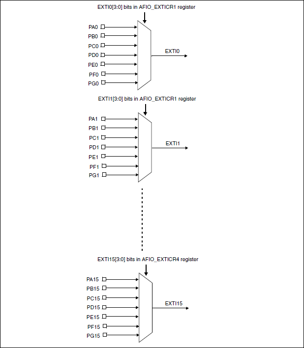
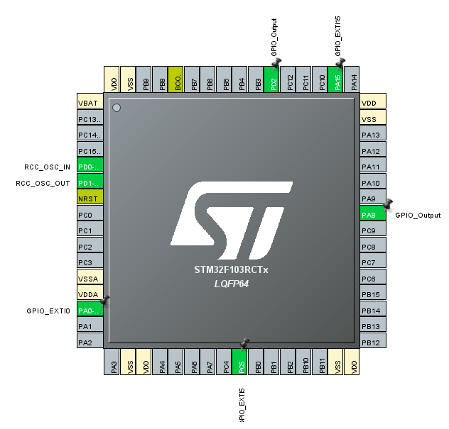
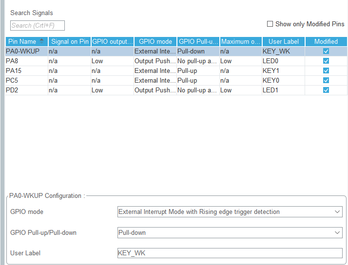
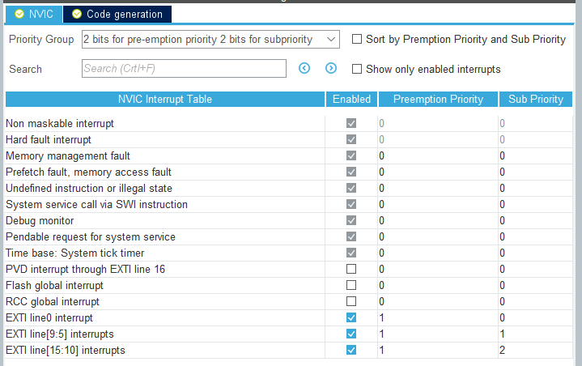
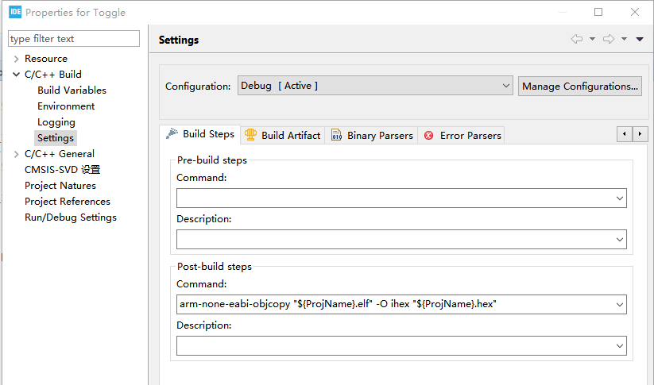
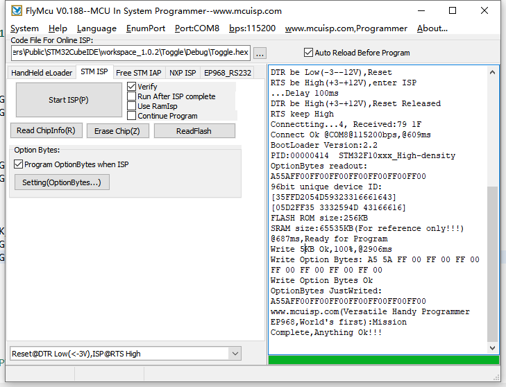

# External Interrupts

## Introduction

Interrupts are input signals to trigger an event that needs handled immediately. When there are interrupts coming, current works should be pause to execute some critical code, which is called interrupt handler or interrupt service routine(ISR), and back to the code where it is paused if the ISR is done. So, interrupts can be used to handle some unexpected moment or task that does not require much execution time. As for external interrupts(EXTI), which is triggered by outside interference, like peripherals. They are different from internal interrupts which is generated automatically by CPU itself.

There are 20 external interrupt lines in STM32F103RCTx. All the GPIOs are connected to the 16 external interrupt lines in the following manner:



The four other EXTI lines are connected as follows:

- EXTI line 16 is connected to the PVD output

- EXTI line 17 is connected to the RTC Alarm event

- EXTI line 18 is connected to the USB Wakeup event

- EXTI line 19 is connected to the Ethernet Wakeup event (available only in connectivity
  line devices)

As for EXTI 0-15, pins connected to the same EXTI line cannot be used as EXTI input at the same time, which means we can configure at most 16 pins as EXTI.


## Configuration on STM32CubeIDE

### Goal

Use the three buttons, **KEY0**, **KEY1** and **WK_UP** as EXTI input to control the LED, rather than check the value of these three GPIO pins in the main routine.

Find the pins connected to **KEY0**, **KEY1**, **WK_UP**, **LED0** and **LED1**, which is **PC5**, **PA15**, **PA0**, **PA8** and **PD2**.



- Config the pins connected to the buttons as **GPIO_EXTI**, and the pins connected to LEDs as **GPIO_Output**

### Signal edge


we can configure the **GPIO Mode** as rising edge, falling edge or rising/falling edge to decide when to trigger interrupt.




It is clear that the voltage should be 0v, when **KEY0** and **KEY1** are press,  while the voltage should 3.3v, when **WK_UP** is press. So the **GPIO Mode** of **PA15** and **PC5** should be falling edge, while the **GPIO Mode** of **PA0** should be rising edge.

### Priority

There are two kinds of priority in STM32: preemption priority and sub priority. If the two interrupts has the different preemption priority, the interrupt with the higher priority(lower value) can preempt the interrupt with the lower priority(higher value). If the two interrupts has the same preemption priority, they cannot preempt each other. We also can configure the priority group to change the amounts of priority.



- configure the preemption priority and sub priority

### API

Through there are 16 EXTI lines, only EXTI 0~4 has its own interrupt function, while EXTI 5~9 share ``EXTI9_5_IRQHandler`` and EXTI 10~15 share ``EXTI15_10_IRQHandler``.

```c
void EXTI0_IRQHandler();
void EXTI1_IRQHandler();
void EXTI2_IRQHandler();
void EXTI3_IRQHandler();
void EXTI4_IRQHandler();
void EXTI9_5_IRQHandler();
void EXTI15_10_IRQHandler();
```

But we don't need to put our code into these functions. Following is the code generated by STM32CubeIDE related to EXTI:

```c
/**
  * @brief This function handles EXTI line0 interrupt.
  */
void EXTI0_IRQHandler(void)
{
  /* USER CODE BEGIN EXTI0_IRQn 0 */

  /* USER CODE END EXTI0_IRQn 0 */
  HAL_GPIO_EXTI_IRQHandler(GPIO_PIN_0);
  /* USER CODE BEGIN EXTI0_IRQn 1 */

  /* USER CODE END EXTI0_IRQn 1 */
}

/**
  * @brief This function handles EXTI line[9:5] interrupts.
  */
void EXTI9_5_IRQHandler(void)
{
  /* USER CODE BEGIN EXTI9_5_IRQn 0 */

  /* USER CODE END EXTI9_5_IRQn 0 */
  HAL_GPIO_EXTI_IRQHandler(GPIO_PIN_5);
  /* USER CODE BEGIN EXTI9_5_IRQn 1 */

  /* USER CODE END EXTI9_5_IRQn 1 */
}

/**
  * @brief This function handles EXTI line[15:10] interrupts.
  */
void EXTI15_10_IRQHandler(void)
{
  /* USER CODE BEGIN EXTI15_10_IRQn 0 */

  /* USER CODE END EXTI15_10_IRQn 0 */
  HAL_GPIO_EXTI_IRQHandler(GPIO_PIN_15);
  /* USER CODE BEGIN EXTI15_10_IRQn 1 */

  /* USER CODE END EXTI15_10_IRQn 1 */
}
```

It is clear that all the handler call the public EXTI handler:

```c
/**
  * @brief  This function handles EXTI interrupt request.
  * @param  GPIO_Pin: Specifies the pins connected EXTI line
  * @retval None
  */
void HAL_GPIO_EXTI_IRQHandler(uint16_t GPIO_Pin)
{
  /* EXTI line interrupt detected */
  if (__HAL_GPIO_EXTI_GET_IT(GPIO_Pin) != 0x00u)
  {
    __HAL_GPIO_EXTI_CLEAR_IT(GPIO_Pin);
    HAL_GPIO_EXTI_Callback(GPIO_Pin);
  }
}
```

The function call the ``__HAL_GPIO_EXTI_CLEAR_IT`` to clear the EXTI's line pending bits, otherwise, the EXTI handler will be executed all the time, while the ``HAL_GPIO_EXTI_Callback`` is a weak function:

```c
/**
  * @brief  EXTI line detection callbacks.
  * @param  GPIO_Pin: Specifies the pins connected EXTI line
  * @retval None
  */
__weak void HAL_GPIO_EXTI_Callback(uint16_t GPIO_Pin)
{
  /* Prevent unused argument(s) compilation warning */
  UNUSED(GPIO_Pin);
  /* NOTE: This function Should not be modified, when the callback is needed,
           the HAL_GPIO_EXTI_Callback could be implemented in the user file
   */
}
```

So, we should re-implement this function in **stm32f1xx_it.c**(or **main.c**):

``` c
void HAL_GPIO_EXTI_Callback(uint16_t GPIO_Pin)
{
  HAL_Delay(100);
  switch (GPIO_Pin) {
	case KEY0_Pin:
	  if (HAL_GPIO_ReadPin(KEY0_GPIO_Port, KEY0_Pin) == GPIO_PIN_RESET) {
		HAL_GPIO_TogglePin(LED0_GPIO_Port, LED0_Pin);
	  }
	  break;
	case KEY1_Pin:
      if (HAL_GPIO_ReadPin(KEY1_GPIO_Port, KEY1_Pin) == GPIO_PIN_RESET) {
		HAL_GPIO_TogglePin(LED1_GPIO_Port, LED1_Pin);
      }
	  break;
	case KEY_WK_Pin:
      if (HAL_GPIO_ReadPin(KEY_WK_GPIO_Port, KEY_WK_Pin) == GPIO_PIN_SET) {
		HAL_GPIO_TogglePin(LED0_GPIO_Port, LED0_Pin);
		HAL_GPIO_TogglePin(LED1_GPIO_Port, LED1_Pin);
      }
      break;
	default:
      break;
  }
}
```

Compile and programs it into the MCU.


## Programming without ST-Link/J-Link

The only way to program the binary file into the MCU in STM32CubeIDE is using debug, which needs ST-Link/J-Link. If you don't have ST-Link/J-Link, you can use .hex file and program it into the MCU by USART. 



- Configure the build settings, and add ``arm-none-eabi-objcopy "${ProjName}.elf" -O ihex "${ProjName}.hex"`` into the **Post-build steps Command**, or just type the corresponding command in the command line



- Open [FlyMcu.exe](./FlyMcu.exe), configure the software as the figure shows, and click **Start ISP(P)** to program the .hex file into the MCU


## Assignment

1. Use **EXTI** to control the LED: Press **KEY0** to blink **LED0** three times, press **KEY1** to blink **LED1** three times, and transmit the corresponding message by UART.

2. Receive UART data in **non-blocking** mode: when the UART receives the text **interrupt**, transmits the corresponding message by UART.

3. Due on **October 23, 2019 11:00pm**